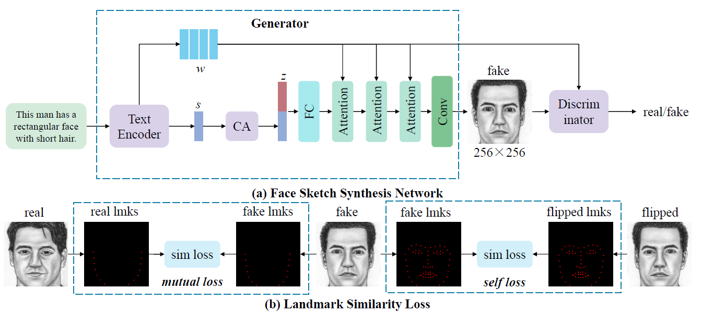
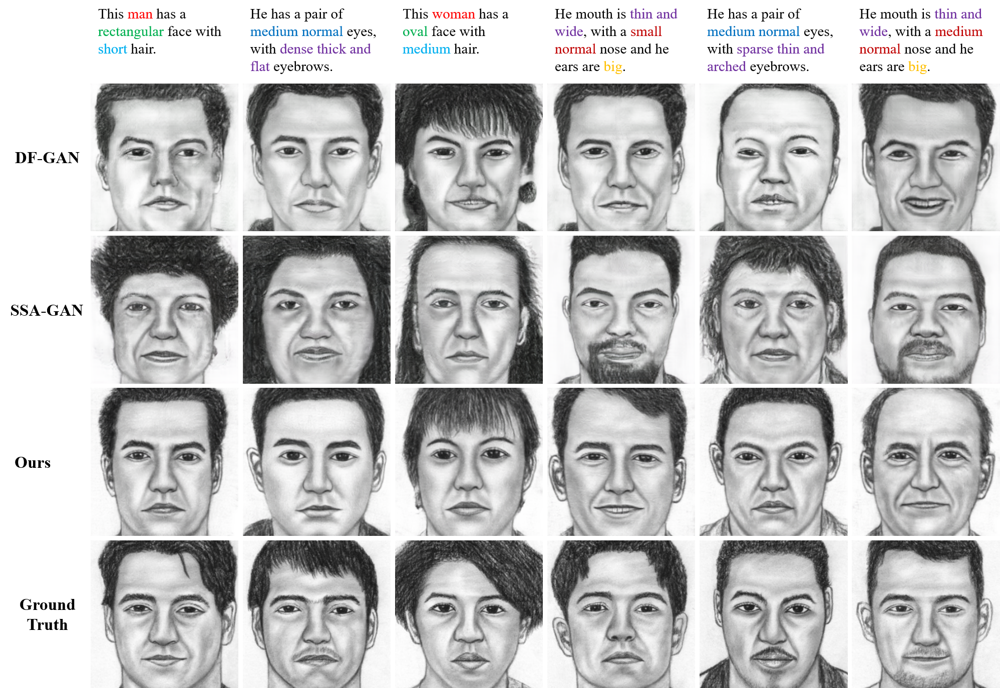

# LAGAN 
Pytorch implementation for (PRCV 2022) LAGAN: Landmark Aided Text to Face Sketch Generation. 

### Overview


<!-- **[LAGAN: Landmark Aided Text to Face Sketch Generation](https://papers.nips.cc/paper/8480-controllable-text-to-image-generation.pdf).**  
[Bowen Li](http://mrlibw.github.io/), [Xiaojuan Qi](https://xjqi.github.io/), [Thomas Lukasiewicz](http://www.cs.ox.ac.uk/people/thomas.lukasiewicz/), [Philip H. S. Torr](http://www.robots.ox.ac.uk/~phst/).<br> University of Oxford <br> In Neural Information Processing Systems, 2019. <br> -->

### Data

**TextCUFSF** dataset has been included in `data/sketches/`


### Training
All code was developed and tested on Ubuntu 16.04 with Python 3.7 (Anaconda) and PyTorch 1.1.

#### [DAMSM](https://github.com/taoxugit/AttnGAN) model includes text encoder and image encoder
- Pre-train DAMSM model for TextCUFSF dataset:
```
python pretrain_DAMSM.py --cfg cfg/DAMSM/sketches_18_4.yml --gpu 0
```

#### LAGAN model 
- Train LAGAN model for TextCUFSF dataset:
```
python main.py --cfg cfg/train_sketch_18_4.yml --gpu 1
```

`*.yml` files include configuration for training and testing.


### Testing
- Test LAGAN model for bird dataset:
```
python main.py --cfg cfg/eval_sketch_18_4.yml --gpu 2
```

<!-- ### Evaluation

- To generate images for all captions in the testing dataset, change B_VALIDATION to `True` in the eval_*.yml. 
- Inception Score for bird dataset: [StackGAN-inception-model](https://github.com/hanzhanggit/StackGAN-inception-model).
- Inception Score for coco dataset: [improved-gan/inception_score](https://github.com/openai/improved-gan/tree/master/inception_score). -->

**Examples generated by LAGAN**




### Code Structure
- code/main.py: the entry point for training and testing.
- code/trainer_mutual_self.py: creates the main networks, harnesses and reports the progress of training.
- code/model.py: defines the architecture of LAGAN.
- code/attention.py: defines the spatial and channel-wise attentions.
- code/VGGFeatureLoss.py: defines the architecture of the VGG-16.
- code/datasets.py: defines the class for loading images and captions.
- code/pretrain_DAMSM.py: creates the text and image encoders, harnesses and reports the progress of training. 
- code/miscc/losses.py: defines and computes the losses.
- code/miscc/config.py: creates the option list.
- code/miscc/utils.py: additional functions.

### Citiation
**If you find this work helpful, please consider citing:**
```
@inproceedings{LAGAN,
  title={LAGAN: Landmark Aided Text to Face Sketch Generation},
  author={Chao, Wentao and Chang, Liang and Xi, Fangfang and Duan, Fuqing},
  booktitle={Chinese Conference on Pattern Recognition and Computer Vision (PRCV)},
<!--   pages={3--15}, -->
  year={2022},
  organization={Springer}
}
```

### Acknowledgements
This code borrows heavily from [ControlGAN](https://github.com/mrlibw/ControlGAN) repository. Thanks a lot.
